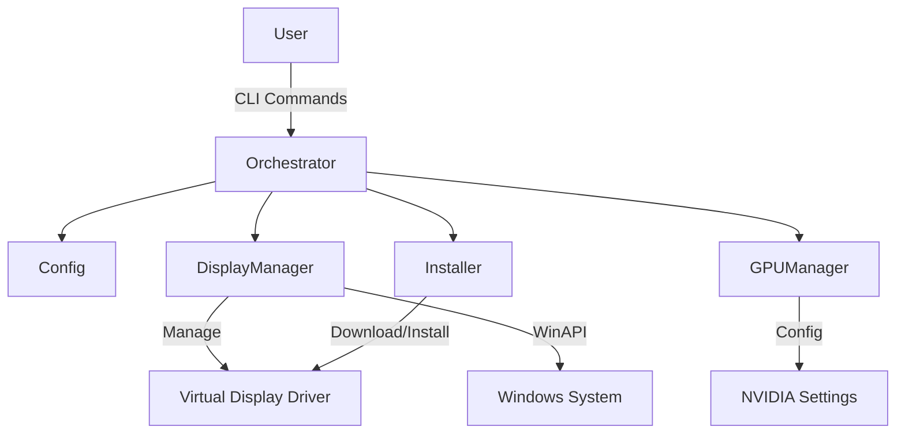
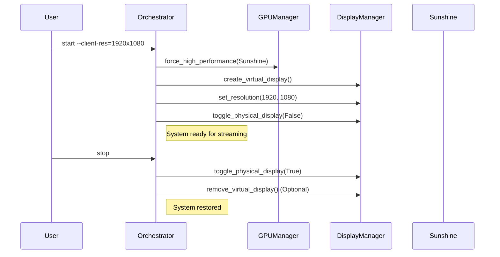

# Easy Game Streaming with Moonlight and Sunshine

This project provides tools to simplify game streaming setup using Moonlight and Sunshine, specifically optimized for Windows 11 laptops with hybrid graphics (e.g., Intel iGPU + NVIDIA dGPU).

It automates the process of creating a virtual display, matching the client's resolution, forcing the use of the discrete GPU, and managing power settings (like turning off the physical screen) to ensure a seamless and high-performance streaming experience.

## Features

- **Virtual Display Management**: Automatically creates and manages virtual displays using the [Virtual Display Driver](https://github.com/VirtualDrivers/Virtual-Display-Driver).
- **Resolution Matching**: Adjusts the virtual display resolution to match the Moonlight client's resolution (or a compatible aspect ratio).
- **Power Management**: Turns off the laptop's physical display during streaming to save power and prevent distractions.
- **GPU Optimization**: Forces Sunshine and the virtual display to run on the discrete GPU (dGPU) for maximum performance.
- **Automated Lifecycle**: Handles the entire flow from setup to teardown with simple CLI commands.

## Architecture

The project consists of a Python-based orchestrator that manages several modules for display, GPU, and process management.

### Component Diagram



### Workflow



## Prerequisites

- **Operating System**: Windows 10 or Windows 11 (x64).
- **Python**: Python 3.10 or higher.
- **Admin Privileges**: Required for installing drivers and changing system settings.
- **Sunshine**: Installed and configured (default path: `C:\Program Files\Sunshine\Sunshine.exe`).
- **Moonlight**: Installed on your client device.

## Installation

1. **Clone the Repository**:
   ```bash
   git clone https://github.com/your-username/easy-game-streaming.git
   cd easy-game-streaming
   ```

2. **Install Dependencies**:
   ```bash
   pip install -r requirements.txt
   ```

3. **Install Virtual Display Driver**:
   Run the installation command to download and install the required Virtual Display Driver.
   ```bash
   python src/orchestrator.py install
   ```
   *Note: This script attempts to automate the driver installation using `pnputil`. If it fails, follow the manual instructions in the output or check the [Virtual Display Driver Wiki](https://github.com/VirtualDrivers/Virtual-Display-Driver/wiki/Installation).*

## Usage

The `orchestrator.py` script is the main entry point for the application.

### Start Streaming Setup

Prepares the system for streaming: forces dGPU, creates a virtual display, sets resolution, and turns off the physical screen.

```bash
python src/orchestrator.py start --client-res=1920x1080
```
*Replace `1920x1080` with your client's resolution.*

### Stop Streaming Setup

Restores the system: turns the physical screen back on.

```bash
python src/orchestrator.py stop
```

### Install Dependencies

Downloads and installs the Virtual Display Driver.

```bash
python src/orchestrator.py install
```

## Configuration

Configuration is managed via `src/config.py` and can be customized using a JSON file or environment variables.

### settings.json

Create a file named `config/settings.json` to override defaults. Example:

```json
{
    "sunshine_path": "C:\\Path\\To\\Sunshine.exe",
    "driver_tool_path": "C:\\Path\\To\\VirtualDriverControl.exe",
    "deps_path": "deps"
}
```

### Environment Variables

You can also set environment variables to override settings:

- `SUNSHINE_PATH`: Path to the Sunshine executable.
- `DRIVER_TOOL_PATH`: Path to the Virtual Driver Control executable.
- `VIRTUAL_DISPLAY_DRIVER_URL`: URL to download the driver zip.
- `DEPS_PATH`: Directory to store dependencies.

## Technical Details

This project leverages several Windows APIs and external tools:

- **Virtual Display Driver**: An open-source Indirect Display Driver (IDD) that allows creating virtual monitors with custom resolutions and refresh rates.
- **pywin32**: Used to interact with Windows API for display settings (`ChangeDisplaySettingsEx`) and system metrics (`GetSystemMetrics`).
- **ctypes**: Used for low-level system calls, such as broadcasting power messages to turn off monitors.
- **psutil**: (Planned) For monitoring the Sunshine process.
- **Registry & NVIDIA API**: Used to enforce "High Performance" GPU preference for the streaming process.

For a deeper dive into the design, check out the [Technical Design Document](docs/TECHNICAL_DESIGN.md).

## Troubleshooting

- **Driver Installation Fails**: If the automated install fails, go to the `deps/` folder (created after running `install`) and follow the manual installation steps:
    1. Run the certificate installer `.bat` file as Admin.
    2. Add the driver via Device Manager -> "Add legacy hardware".
- **Resolution Not Supported**: Ensure the requested resolution is supported by the Virtual Display Driver. You may need to edit the driver's options file if you need very specific custom resolutions.
- **Physical Screen Won't Turn Off**: Some laptops or Windows settings might interfere with `SendMessage(SC_MONITORPOWER)`. Ensure no other input is waking the screen immediately.

## Contributing

Contributions are welcome! Please follow these steps:

1. Fork the repository.
2. Create a feature branch (`git checkout -b feature/amazing-feature`).
3. Commit your changes (`git commit -m 'Add some amazing feature'`).
4. Push to the branch (`git push origin feature/amazing-feature`).
5. Open a Pull Request.

## Support My Projects

If you find this repository helpful and would like to support its development, consider making a donation:

### GitHub Sponsors
[](https://github.com/sponsors/toxicoder)

### Buy Me a Coffee
<a href="https://www.buymeacoffee.com/toxicoder" target="_blank">
    
</a>

### PayPal
[](https://www.paypal.com/donate/?hosted_button_id=LSHNL8YLSU3W6)

### Ko-fi
<a href="https://ko-fi.com/toxicoder" target="_blank">
    
</a>

### Coinbase
[](https://commerce.coinbase.com/checkout/e07dc140-d9f7-4818-b999-fdb4f894bab7)

Your support helps maintain and improve this collection of development tools and templates. Thank you for contributing to open source!

## License

This project is licensed under the MIT License - see the [LICENSE](LICENSE) file for details.
